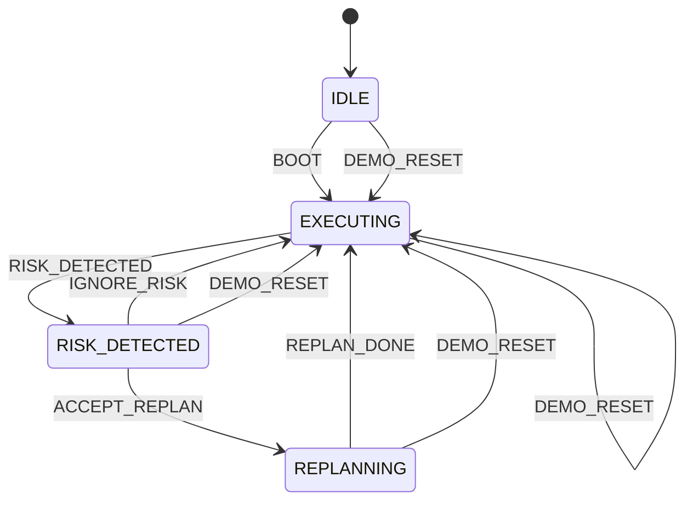

# STATE_MACHINE（状态机与状态系统说明）

本项目将状态分为三层：

1. **MachineState**：驱动流程（执行/风险/重排）— 严格有限状态机  
2. **ReplanPhase**：仅在 REPLANNING 内部用于 UI 子阶段动效  
3. **PlanState / UIState**：业务数据与视图状态（Context + reducer）

---

## 1. MachineState（流程状态机）

定义位置：`src/types/plan.ts`  
转换逻辑：`src/context/machineReducer.ts`

### 1.1 状态枚举

```ts
type MachineState =
  | "IDLE"
  | "EXECUTING"
  | "RISK_DETECTED"
  | "REPLANNING"
  | "COMPLETED";
```

### 1.2 事件枚举

定义位置：`src/context/machineReducer.ts`

- `BOOT`：启动进入执行态
- `RISK_DETECTED`：触发风险进入风险态
- `IGNORE_RISK`：忽略风险回到执行态
- `ACCEPT_REPLAN`：接受建议进入重排态
- `REPLAN_DONE`：重排完成回到执行态
- `DEMO_RESET`：重置演示回到执行态

### 1.3 转换规则（实际实现）

```text
IDLE --BOOT--> EXECUTING

EXECUTING --RISK_DETECTED--> RISK_DETECTED

RISK_DETECTED --IGNORE_RISK--> EXECUTING
RISK_DETECTED --ACCEPT_REPLAN--> REPLANNING

REPLANNING --REPLAN_DONE--> EXECUTING

任何状态 --DEMO_RESET--> EXECUTING
```

说明：

- 风险触发只允许在 `EXECUTING` 且无 activeRisk 时进入（由 `useDashboardRiskActions` 保护）。
- REPLANNING 中拒绝新的风险触发（避免并发/重入）。

---

## 2. ReplanPhase（Replan 子阶段）

定义位置：`src/types/plan.ts`  
推进位置：`src/replan/startReplanFlow.ts`

### 2.1 子阶段枚举

```ts
type ReplanPhase =
  | "idle"
  | "freezing"
  | "deconstructing"
  | "generating"
  | "animating"
  | "done";
```

### 2.2 生命周期与 UI 对应

```text
idle
  ↓（接受建议）
freezing         : 时间轴整体 blur(2px) + opacity(0.45)
  ↓
deconstructing   : 旧卡片 exit（x:40, opacity:0, scale:0.98）
  ↓
generating       : ReplanOverlay 显示 “AI 正在重新规划...”；追加执行日志
  ↓
animating        : 新卡片 enter（y:20→0, opacity:0→1），stagger 80ms
  ↓
done             : 收尾；Machine 回到 EXECUTING；展示推理提示；清理 inserted order
  ↓
idle
```

关键字段：

- `UIState.replanInsertedOrder`：`animating` 阶段用于确定新卡片 stagger 顺序（由 `startReplanFlow` 计算）

---

## 3. 风险状态（Risk UI）

### 3.1 风险信号结构

定义位置：`src/types/plan.ts`

```ts
interface RiskSignal {
  risk_id: string;
  type: "queue" | "weather" | "fatigue" | "time" | "budget" | "closure";
  severity: "medium" | "high";
  title: string;
  description: string;
  affected_card_ids: string[];
}
```

### 3.2 UI 相关字段

定义位置：`src/types/plan.ts` + `src/context/uiReducer.ts`

- `UIState.activeRisk`：当前风险（驱动 `RiskWarningBar`）
- `UIState.riskStatusSnapshot`：风险触发前的受影响卡片 status 快照（用于 ignore 回滚）
- `UIState.agentMessage`：右列推理提示（Replan 完成后更新并定时清空）

---

## 4. 状态切换图（总览）



---

## 5. 推荐调试入口（工程定位）

- 状态机：`src/context/machineReducer.ts`
- UI reducer：`src/context/uiReducer.ts`
- Replan 生命周期：`src/replan/startReplanFlow.ts`
- 风险触发与 reset：`src/hooks/useDashboardRiskActions.ts`
- 自动风险：`src/hooks/useRiskMonitor.ts` + `src/components/RiskRuntime.tsx`

